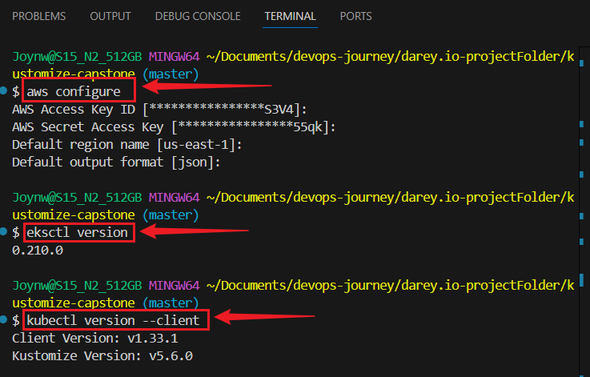
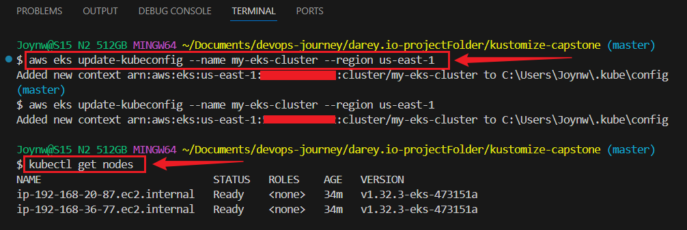

# Implementing a Multi-Environment Application Deployment with Kustomize


> This project demonstrates how to deploy a Kubernetes-based web application using **Kustomize** with environment-specific overlays for **development**, **staging**, and **production**. It also includes a **GitHub Actions CI/CD pipeline** that automatically applies changes to a Kubernetes cluster.


## Project Structure

```
kustomize-capstone/
├── base/ 
├── .github/
│ └── workflows/
│ └── deploy.yaml 
├── .gitignore
│ ├── deployment.yaml
│ ├── service.yaml
│ └── kustomization.yaml
`-- overlays
    |-- dev
    |   |-- kustomization.yaml
    |   `-- patch-deployment.yaml
    |-- prod
    |   |-- kustomization.yaml
    |   `-- patch-deployment.yaml
    `-- staging
        |-- kustomization.yaml
        `-- patch-deployment.yaml
```

## Kustomize Overview

**Kustomize** allows customizing Kubernetes YAML configurations without duplication.

- `base/`: Shared configuration (Deployment, Service, etc.)
- `overlays/`: Environment-specific overrides (e.g., replica count, config values)
- Supports:
  - `patches`
  - `configMapGenerator`
  - `secretGenerator`
  - `commonLabels`


## Step 1: Project Set Up 

### 1.1 Create the main folder and folder structure
```bash
mkdir kustomize-capstone
cd kustomize-capstone
mkdir -p base overlays/dev overlays/staging overlays/prod
```

## Step 2: Initialize Git

- Initialize the Git repository:
```bash
git init
```

### Create a .gitignore file to ignore temporary files:
```bash
touch .gitignore
```

### Paste

```bash
echo "node_modules/
*.log
.env
.DS_Store" > .gitignore
```

### Save it
```bash
git add .
git commit -m "Initial project setup"
```

## Step 3: Define Base Configuration

- Create a simple web app deployment.

### 3.1: Inside the `base/` directory:
```bash
cd base
```

### Create:
```bash
touch deployment.yaml service.yaml kustomization.yaml
```


### `base/deployment.yaml`

### Paste:
```bash
apiVersion: v1
kind: Service
metadata:
  name: my-app-service
spec:
  selector:
    app: my-app
  ports:
    - protocol: TCP
      port: 80
      targetPort: 80
  type: ClusterIP
```

### `base/service.yaml`

### Paste:
```bash
apiVersion: v1
kind: Service
metadata:
  name: my-app-service
spec:
  selector:
    app: my-app
  ports:
    - protocol: TCP
      port: 80
      targetPort: 80
  type: ClusterIP
```


### `base/kustomize.yaml`

### Paste:
```bash
apiVersion: kustomize.config.k8s.io/v1beta1
kind: Kustomization
resources:
  - deployment.yaml
  - service.yaml
```

## Step 4: Create Environment-Specific Overlays

### 4.1: Create a `kustomization.yaml` in each overlay directory (`overlays/dev/, overlays/staging/, overlays/prod/`):
```bash
cd ../overlays/dev
touch kustomization.yaml
cd ../staging
touch kustomization.yaml
cd ../prod
touch kustomization.yaml
```

### 4.2: Create patch files
```bash
cd ../dev
touch patch.yaml
cd ../staging
touch patch.yaml
cd ../prod
touch patch.yaml
```


### Dev kustomization.yaml:
`overlays/dev/kustomization.yaml`

### Paste:
```bash
apiVersion: kustomize.config.k8s.io/v1beta1
kind: Kustomization
bases:
  - ../../base
patchesStrategicMerge:
  - patch.yaml
```

### Dev patch.yaml:
`overlays/dev/patch.yaml`
```bash
apiVersion: apps/v1
kind: Deployment
metadata:
  name: my-app
spec:
  replicas: 1
  template:
    spec:
      containers:
      - name: my-app
        env:
        - name: ENVIRONMENT
          value: "development"
```


### Staging kustomization.yaml:
`overlays/staging/kustomization.yaml`
```bash
apiVersion: kustomize.config.k8s.io/v1beta1
kind: Kustomization
bases:
  - ../../base
patchesStrategicMerge:
  - patch.yaml
```


### Staging patch.yaml:
`overlays/staging/patch.yaml`
```bash
apiVersion: apps/v1
kind: Deployment
metadata:
  name: my-app
spec:
  replicas: 2
  template:
    spec:
      containers:
      - name: my-app
        env:
        - name: ENVIRONMENT
          value: "staging"
        resources:
          limits:
            cpu: "500m"
            memory: "512Mi"
          requests:
            cpu: "200m"
            memory: "256Mi"
```


### Prod kustomization.yaml:
`overlays/prod/kustomization.yaml`

### Paste:
```bash
apiVersion: kustomize.config.k8s.io/v1beta1
kind: Kustomization
bases:
  - ../../base
patchesStrategicMerge:
  - patch.yaml
```

### Prod patch.yaml:
`overlays/prod/patch.yaml`
```bash
apiVersion: apps/v1
kind: Deployment
metadata:
  name: my-app
spec:
  replicas: 3
  template:
    spec:
      containers:
      - name: my-app
        env:
        - name: ENVIRONMENT
          value: "production"
        resources:
          limits:
            cpu: "1000m"
            memory: "1024Mi"
          requests:
            cpu: "500m"
            memory: "512Mi"
```


## Step 5: Set Up AWS EKS and CI/CD Pipeline with GitHub Actions

- Configure AWS CLI:
```bash
aws configure
eksctl version
kubectl version --client
```



- Create EKS Cluster:
```bash
eksctl create cluster --name my-eks-cluster --region us-east-1 --nodegroup-name standard-workers --node-type t3.medium --nodes 2 --nodes-min 1 --nodes-max 3 --managed
```


- Update kubeconfig:
```bash
aws eks update-kubeconfig --name my-eks-cluster --region us-east-1
```

- Test It:
```bash
kubectl get nodes
```



#### 5.1: Set Up GitHub Actions
- Create a GitHub repository:

```bash
git branch -m master main
git remote add origin <your-repo-url>
git push -u origin main
```

#### 5.2. Create a GitHub Actions workflow to deploy to EKS:
```
mkdir -p .github/workflows
touch .github/workflows/deploy.yaml
```

#### 5.3. Add the workflow to deploy the app:
`.github/workflows/deploy.yaml`
```bash
name: Deploy to EKS
on:
  push:
    branches:
      - main
jobs:
  deploy:
    runs-on: ubuntu-latest
    steps:
    - name: Checkout code
      uses: actions/checkout@v3
    - name: Set up kubectl
      uses: azure/setup-kubectl@v3
      with:
        version: 'latest'
    - name: Configure AWS credentials
      uses: aws-actions/configure-aws-credentials@v2
      with:
        aws-access-key-id: ${{ secrets.AWS_ACCESS_KEY_ID }}
        aws-secret-access-key: ${{ secrets.AWS_SECRET_ACCESS_KEY }}
        aws-region: us-east-1
    - name: Update kubeconfig
      run: aws eks update-kubeconfig --name my-eks-cluster --region us-east-1
    - name: Deploy to EKS (Dev)
      run: kubectl apply -k overlays/dev
```

#### Step 5.4: Add Secrets to GitHub 
   - Go to your GitHub repo → Settings → Secrets → Actions.
   - Add `AWS_ACCESS_KEY_ID` and `AWS_SECRET_ACCESS_KEY` from your AWS account.


   
## Step 6: - Test the CI/CD Pipeline

- Change the dev overlay, set replicas: 2 in overlays/dev/patch.yaml
```bash
replicas: 2 
```

- Save and push the change.
```bash
git add .
git commit -m "Increase replicas in dev to 2"
git push origin main
```

#### - Check GitHub Actions:
  - Go to your GitHub repo → Actions.
  - See if the “Deploy to EKS” job runs successfully.


- Verify in EKS:
```bash
kubectl get pods -n default
```


## Task 7: Manage Secrets and ConfigMaps

#### - Create base/configmap.yaml:
```bash
touch base/configmap.yaml
```
 
#### Paste:
```bash
apiVersion: v1
kind: ConfigMap
metadata:
  name: my-app-config
data:
  APP_NAME: "My Web App"
```

#### Create base/secret.yaml:
```bash
apiVersion: v1
kind: Secret
metadata:
  name: my-app-secret
type: Opaque
data:
  API_KEY: YXBpLWtleS1leGFtcGxlCg==
```

